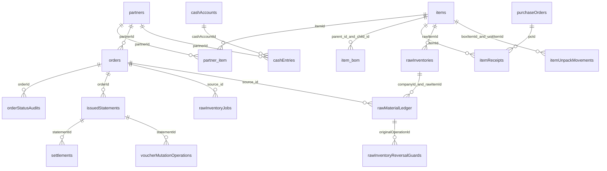
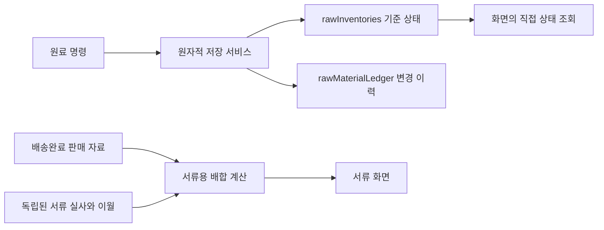

# 태백 ERP 현재 관계와 지향 설계 대조 — 2026-10-07

기준: 기존 통합 저장소 534b67fa 이후 문서 보완. 원료·주문 관계는 제품 변경 955e4ab8을 기준으로 확인했고, 이어 거래처 원장 조회 화면을 보완했다. 이 문서는 **코드에서 확인한 관계**이며 Firestore 전 문서 실측, 외래키 강제, 모든 읽기·쓰기 완전 추적을 주장하지 않는다. registry와 생성기 결과는 field-dictionary.generated.md/json에서 재생성한다.

2026-10-07 후속 기준: 28e75bfa까지의 앱 코드에는 회사별 HACCP 조회·공용 저장, 반복전표 발행, 원장 설명 갱신, 주문 이월 표시와 미사용 품목 필드 정리가 반영됐다. 생성 사전은 최신 `src/shared/types.ts` 선언과 참조 위치로 다시 만든다. 제거한 `Item.itemType`, `Item.partnerId`, `Item.partnerBoxConfigs` 및 고립된 박스 설정 타입은 현재 선언 목록에서 제외한다. 운영 DB 필드 삭제나 데이터 이관을 뜻하지 않는다.

서버 기준은 별도로 대조해야 한다. 현재 `functions/src`와 10월 6일 실제 배포 동결본 `outputs/partner-payment-deployed-20261006/src` 사이에는 51파일 차이가 확인됐다. 생성기의 서버 부분은 작업 저장소 `functions/src`를 분석하며 실제 배포 서버의 전체 모델·writer를 보장하지 않는다. 서버 변경이나 운영 관계 판단에는 동결본을 함께 확인하고, 이 사전만 근거로 현재 Functions 소스를 배포하지 않는다.

## 현재 관계 — 코드에서 확인

관계선은 문서 ID 참조·내장 배열·조회 조건을 나타낸다. Firestore가 SQL 외래키나 필수 cardinality를 강제한다는 뜻은 아니다. 저장된 옛 문서에는 선택값과 누락값이 있을 수 있다.

| 연결/값 | 현재 의미와 근거 |
| --- | --- |
| companyId | 회사 범위. 조회·쓰기 경계와 서버 claim 검사가 별개로 존재. 코드상 구형 기본값 처리도 있어 모든 DB 문서에 필수 저장됐다고 판단하지 않는다. src/shared/companyWriteBoundary.ts, src/shared/services/firebaseService.ts |
| partner_item | itemId/partnerId와 Direction in/out, 단가·과세·배송지 선택. 판매 연결은 여기서 조인한다. items.partnerIds 자동판매연결은 복구하지 않는다. src/shared/types.ts:108, src/features/admin/AdminApp.tsx:636 |
| orders.items/itemInventory/inventorySnapshots | 주문 품목·줄별 생산 적용 상태·생산/출고 원복 근거가 주문 안에 저장된다. 별도 collection으로 그리지 않는다. src/shared/types.ts:233, src/features/admin/orderStockEngine.ts:638 |
| item_bom | parent_id/child_id는 items ID, quantity는 구성 수량. src/shared/types.ts:1409 |
| item_formula | parent_key/child_name은 이름 기반 키, ratio/yield_rate. items ID 외래키라고 그리지 않는다. src/shared/types.ts:1400 |
| item_pack | PackRow 별도 모델과 정적 fetch 존재. shared/types 직접 인터페이스 사전에 없는 모델. src/shared/hooks/useAppData.ts:351, src/shared/packIndex.ts:26 |
| rawInventories | 회사·rawItemId별 상태, stockKg/activeLots/recentDepletedLots/revision/stocktakeAnchor. shared/types.ts가 아닌 rawInventoryCore.ts:49 선언. |
| rawMaterialLedger | 새 operationId/commandHash/sequence/lotChanges와 구형 date/material/received/used 등 호환 칸을 같은 collection에 저장. 별도 새 원장 collection으로 오인하지 않는다. src/shared/services/rawInventoryService.ts:52 |
| 구형 작업 문서 ID | 동일 operation의 새 operationDocId와 legacyOperationDocId를 모두 조회해 중복 적용을 막는다. 두 조회가 두 번의 차감을 뜻하지 않는다. src/shared/services/rawInventoryService.ts:162 |
| 원료 상태·원장·items 미러 | 적용 transaction에서 상태와 이력을 쓰고, mirrorToItem 기본 true일 때 items.stock/lots도 갱신한다. ledger 전용 명령 등은 예외. 코어의 ‘복제하지 않는다’ 주석은 현재 쓰기와 다르다. src/shared/services/rawInventoryService.ts:204, 278–285 |
| rawInventoryJobs | 여러 원료 명령의 완료 상태와 expectedOperationIds를 추적. 주문 전체 상태와 동치가 아니며 부분 실패 판단 때 개별 원장과 함께 대조. src/shared/rawInventoryCore.ts:160, src/shared/services/rawInventoryJob.ts |
| 완제품 stock/lots/예약 | items 안의 로트·inventoryReservations, 주문의 출고 snapshot/소진 추적 및 orderStatusAudits를 함께 사용한다. ‘숫자 stock만 있다’는 docOil 상단 주석은 현재 orderProductLots/orderItemStock 구현을 포괄하지 못한다. |

## 실제 배합과 서류 배합 — 현재 연결 구분

- 실제 원료 차감: src/features/admin/bom.ts buildFormula는 item_formula를 우선하고 없으면 PRODUCT_FORMULA를 사용한다. phantom 하위 반제품만 재귀 전개하며, 비 phantom 홀더는 종단으로 취급한다. 순환/깊이 제한은 빈 결과로 끊는다.
- 원가: 같은 파일 formulaRowsOf는 ratio와 yieldRate를 분리한다. 차감 계산의 ratio×yield_rate를 원가와 같다고 설명하지 않는다.
- 서류 판매·원료 배분: src/shared/docOil.ts addOilByRaw/mixLabel은 PRODUCT_FORMULA를 사용한다. 실제 원료 자동차감과 같은 날짜·수량이라고 가정하지 않는다.
- **현재 화면 연결 차이**: docOil.ts는 rawDocEntries 별도 서류 실사/이월 모델과 buildRawDocMonth를 정의하지만, 현재 AdminApp.tsx:4007 이후 buildRawDocSheet는 mergedRawMaterialLedger를 읽고 재고 실사 ID를 필터한다. 전월이월도 해당 화면 계산을 사용한다. 조사한 src/components/functions에서 rawDocEntries Firestore 호출·현재 화면의 buildRawDocMonth 연결을 확인하지 못했다. 따라서 rawDocEntries를 ‘운영에서 별도 저장 중’으로 그리지 않는다. 모델/순수 계산 존재와 실제 연결을 구분한다.

## registry 밖 경로 — 현재 소스 근거

자동 inventory는 SDK collection/doc 참조와 동적 표현식의 출처를 기록한다. 동적 wrapper의 실제 값과 문서 내부 필드를 모두 해석하지 못하므로 보완 범위를 따로 남긴다.

| 경로 | 소스에서 확인한 용도 | 주의 |
| --- | --- | --- |
| appMeta/releaseCutover | 활성 release 검사 | 회사 업무문서와 같은 일반 회사 컬렉션으로 단정하지 않는다. |
| appMeta/partnerPaymentState_* | 거래처 결제 상태 조회 | 동적 문서 ID. src/features/statements/infrastructure/issueTradeStatementCommand.ts:89 |
| appMeta/workOrderReset_* | 작업지시 초기화 회사별 잠금 | 동적 문서 ID. AdminApp.tsx:959 |
| itemUnpackMovements | 박스→낱개 개봉 중복 방지/출처 | items 두 문서와 같은 transaction. boxUnpackService.ts:22 |
| voucherMutationOperations | 서버 전표 수정 idempotency 영수증 | Functions에 실제 참조·쓰기 있음. Hosting 배포만으로 서버 배포 상태를 보증하지 않는다. editIssuedStatementCommand.ts:38 |
| authLoginAttempts | 로그인 실패 횟수/차단 시각/만료 | 서버 전용 보안 경로. employeeLogin.ts:32 |
| rawDocEntries | 모델/설계 주석·순수 계산에 등장 | 조사 범위에서 DB 접근 호출 확인 못함. 위 서류 연결 차이 참조. |

거래처 원장 조회 보완: components/PartnerLedger.tsx는 회사로 제한한 전표·자금 자료를 buildJournals로 해석해 전체 이력과 계정 필터·계정별 기초/당기/기말을 함께 표시한다. 108/251/253/133/254 잔액을 합치지 않으며, 비용전표 대체의 133/254 거래처 태그 누락은 원본 거래처로 읽기 중에만 보완한다. 분개 실패는 경고 이력으로 남기고 잔액에서 제외한다. 독립 수동분개 저장본의 UI 전달 경로는 없으며, helper의 수동분개 시험을 해당 저장본 조회 완료로 주장하지 않는다.

## 지향 관계 — 미구현/검토 제안

아래는 이번 작업으로 바뀐 운영 상태가 아니다. 승인·자료 대조 없이 이관 또는 삭제하지 않는다.

1. 원료 화면이 rawInventories 기준 상태를 직접 읽도록 전환한 뒤 items 미러 제거 가능성을 검증한다. 지금 mirror를 꺼서는 안 된다. 소진 로트 복원은 recentDepletedLots 꼬리가 아닌 이력 lotSnapshot 근거를 유지한다.
2. 서류용 실사/이월 모델과 실제 화면을 일치시킬지 결정한다. 현재 rawMaterialLedger 필터·이월 방식과 rawDocEntries 모델을 혼합해 ‘완료’ 처리하지 않는다.
3. registry 밖 저장 경로를 명시적 관리표 또는 COL에 포함할지 검토한다. 이번에는 이름/보안 규칙/저장 경로를 변경하지 않는다.
4. 이름 기반 item_formula를 ID 기반으로 바꾸려면 이름 동치·구형 fallback·원가/실제차감/서류차감 차이를 먼저 대조한다. 제안만으로 과거 배합을 이관하지 않는다.

## 필드 사전 범위와 남은 검수

- 최신 shared/types.ts 직접 인터페이스 716필드는 **코드 선언 목록**이다. 운영 소스 319개에서 사용처가 해석된 필드는 606개, 미해석 속성 접근은 348개다. SDK 경로 호출은 168개이며 그중 동적·미해석 경로는 120개다. 사전 재생성에 따른 수치로, 미해석 범위를 모두 해결한 결과가 아니다. 정적 property access 수는 DB read/write 건수가 아니며 사용처 0도 삭제 근거가 아니다.
- 보완 사전의 별도 모델은 입력 DTO·계산 결과·UI 상태도 포함할 수 있다. 모두 DB 필드라고 표시하지 않는다. 중첩 타입·교차/유니언 타입·상속·any·동적 인덱스·객체 전개·구형 저장 문서는 완전 해석 대상이 아니다.
- scripts/로컬전용/운영 데이터·Firestore rules/Storage/Auth/FCM은 생성기 운영 TS/TSX 분석 범위와 다르다. 보안 rules상 허용 경로가 실제 사용/문서 존재 증거는 아니다.
- 기존 Figma 세 보드의 삭제는 새 ERD 검수와 승인된 정확 내용 확인 후 수행한다. 이번에는 삭제하지 않았다.
- Notion 원본은 미완료/본부장 판단/완료 이력 뷰가 이미 분리돼 있고 관리키 중복은 0건으로 재조회됐다. 의미 중복 검토는 별도이며 DB 또는 전체 TODO 완료를 선언하지 않는다.
- 계정 500/505→501/502 및 상품매입451 기존 데이터 이관은 사용자 보류를 유지한다.

