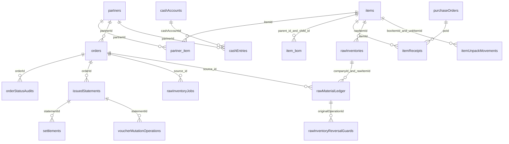
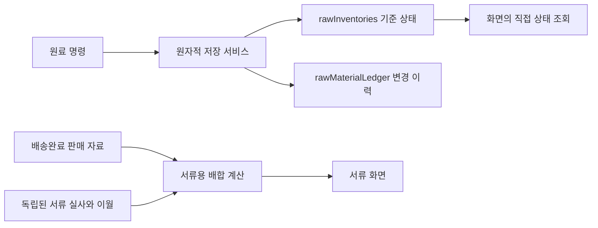

# 태백 ERP 현재 관계와 지향 설계 대조 — 2026-10-07

기준: 기존 통합 저장소 534b67fa 이후 문서 보완. 원료·주문 관계는 제품 변경 955e4ab8을 기준으로 확인했고, 이어 거래처 원장 조회 화면을 보완했다. 이 문서는 **코드에서 확인한 관계**이며 Firestore 전 문서 실측, 외래키 강제, 모든 읽기·쓰기 완전 추적을 주장하지 않는다. registry와 생성기 결과는 field-dictionary.generated.md/json에서 재생성한다.

2026-10-07 후속 기준: 관리자·직원 Hosting과 GitHub main의 `4b574cdd`에는 생산 수량·로트·주문 근거의 원자 저장과 취소 복원 보완이 반영됐다. 생성 사전은 병행 중인 타입 정리가 끝난 뒤 최신 `src/shared/types.ts` 선언과 참조 위치로 통합 재생성한다. 제거한 `Item.itemType`, `Item.partnerId`, `Item.partnerBoxConfigs`, `Item.용량`, `Item.wipStock`, `Item.finishedStock` 및 고립된 박스 설정 타입은 선언 목록에서 제외한다. 운영 DB 필드 삭제나 데이터 이관을 뜻하지 않는다.

서버 기준은 별도로 대조해야 한다. 처음 확인한 51파일 차이 상태는 후속 통합으로 바뀌었다. 현재 `functions/src`는 10월 6일 보존한 거래처 지급 배포본 53개 소스를 기준으로 기존 수정 함수와 export를 보존하고 자동전표 변경을 합친 코드다. 배포 전 읽은 daily/loan ZIP은 각각48개 소스이며 실행 경로의 공유 차이는 releaseGate/voucherIssue였다. 원본 파일 수에는 시험이 포함된다. 이번 생성 시 실제 `functions/src`의 TS56개 중 시험 제외30개를 분석했고 배포 전 ZIP48개 중 시험 제외27개와 구분한다. 후속 commit71d768f6의 선택 dailyAutoVoucher 배포는 완료됐고 총괄 검증에서 새 ZIP generation1791374813509146의56개 소스가 로컬56개와 모두 일치했다. 변경한 Function은 daily 하나뿐이며 loan 등 다른 Functions가 이 통합 소스로 배포됐다는 뜻은 아니다. 대출 안전 거절 후보와 금융 cutover도 별도다. 근거 `docs/todo15-batch2-validation-20261007.md`와 배포 전 `outputs/todo15-current-functions-20261007` ZIP. 이 사전만 근거로 Functions 전체를 배포하지 않는다.

## 사전 생성 당시의 배포 경계와 후속 배포

이번 코드 사전은 생성 당시 `3e2f4ca4` 배포 commit을 기반으로 **당시 checkout의 미배포 TODO022 금융 후보도 포함**하여 생성했다. 배포된 소스만의 사전이나 현재 운영 Functions 전체의 사전이 아니다. 총괄은 세 번째 023/036/039 정확17파일만 양앱 Hosting21171·실제 SHA 검증·GitHub main push 완료로 확인했다. 해당 범위는 수동 snapshot의 저장 cost 평가, 회사 이력·동일 ID 거래처, 안전한 4필드 정리다. 기존 원본 전체 완료로 확대하지 않는다.

사전 생성 당시 checkout의 AdminApp 공용 현금 callback, LoanManager/HRManager의 명령 연결, loanMovementCommand 안전 거절, payrollVoucher와 Rules 회사 gate 보호는 별도 미배포 금융 후보였다. 서비스·관계·필드가 사전에 나와도 실제 배포 또는 양사 cutover 활성화를 뜻하지 않는다. 그 시점에는 양사 급여 firstYearMonth가 사용자 입력 대기였고 대출·급여 운영 gate 쓰기도 없었다. 배포 때 보관한 후보를 총괄이 byte 복원한 사실과 이번 정적 분석 범위를 구분한다.

이번 최종 재생성은 COL69·직접 선언705·분석 소스366·참조 필드611·미해석 속성826, SDK 경로462·동적 경로254·별도 모델566을 기록했다. Functions 현재 TS57개 중 시험 제외30개를 포함한다. 앞의56개는71d768f6 당시 소스/ZIP 증거이며 생성 당시 추가된 미배포 대출 시험과 구분한다. 생성73397 exit0와 후속 self-check/check-only85631 exit0에서 같은 최종 집계를 확인했고 diff check도 통과했다. 미해석 항목은 남아 있으며 런타임 관계를 확정한 것으로 해석하지 않는다.

사전 재생성은 product source 변경이 아니다. 현재 관계 설명의 서버 원자 저장은 해당 구현 계약을 뜻하며, 미배포 후보의 실제 운영 호출 가능 여부는 배포된 Function 버전과 gate 상태를 별도 확인해야 한다. Figma·Notion 쓰기와 운영 데이터 이관은 하지 않았다.

### 2026-10-07 후속 금융 배포·활성화 확인

총괄은 `9c7872f7` 정확30파일 후보의 Hosting·Rules 배포62261과 `recordLoanMovementCommand`·`issuePayrollVoucherCommand` 두 Function 선택 배포35417을 모두 exit0로 확인했다. 두 운영 source ZIP은 각각57소스/로컬57소스 차이0이며 실제 변경 Function은 정확히2개다. Rules SHA `6d9c1937...`와 Hosting 파일 SHA도 일치했다. 다른 Functions 전체 배포나 코드 사전의 미해석 관계 전체 확인으로 확대하지 않는다.

사용자 원문 '둘 다 2026년 10월부터'와 '양사 모두 활성화'에 따라 양사의 대출·급여 cutover 문서4개를 각각1문서만 적용했다. 급여 firstYearMonth는 양사2026-10이며 금융 문서·카운터 쓰기0이다. 독립 검증 `work/todo022-cutover-independent-verification.json`의4개 확인은 모두true, 기존 금융·감사 문서 버전도 동일했다. 실제 급여 지급·대출 거래 테스트를 운영에 가짜로 발행한 결과가 아니다. 이번 사전의 생성 시각과 이 후속 활성화 시각을 구분한다. 해당 commit의 GitHub push 결과는 총괄 후속 확인 대상으로, 이 문단에서 먼저 완료 처리하지 않는다.

## 현재 관계 — 코드에서 확인

관계선은 문서 ID 참조·내장 배열·조회 조건을 나타낸다. Firestore가 SQL 외래키나 필수 cardinality를 강제한다는 뜻은 아니다. 저장된 옛 문서에는 선택값과 누락값이 있을 수 있다.

| 연결/값 | 현재 의미와 근거 |
| --- | --- |
| companyId | 회사 범위. 조회·쓰기 경계와 서버 claim 검사가 별개로 존재. 코드상 구형 기본값 처리도 있어 모든 DB 문서에 필수 저장됐다고 판단하지 않는다. src/shared/companyWriteBoundary.ts, src/shared/services/firebaseService.ts |
| partner_item | itemId/partnerId와 Direction in/out, 단가·과세·배송지 선택. 판매 연결은 여기서 조인한다. items.partnerIds 자동판매연결은 복구하지 않는다. src/shared/types.ts:108, src/features/admin/AdminApp.tsx:636 |
| orders.items/itemInventory/inventorySnapshots | 주문 품목·줄별 생산 적용 상태·생산/출고 원복 근거가 주문 안에 저장된다. 별도 collection으로 그리지 않는다. src/shared/types.ts:233, src/features/admin/orderStockEngine.ts:638 |
| item_bom | parent_id/child_id는 items ID, quantity는 구성 수량. src/shared/types.ts:1409 |
| item_formula | parent_key/child_name은 이름 기반 키, ratio/yield_rate. items ID 외래키라고 그리지 않는다. src/shared/types.ts:1400 |
| item_pack | PackRow 별도 모델과 정적 fetch 존재. shared/types 직접 인터페이스 사전에 없는 모델. src/shared/hooks/useAppData.ts:351, src/shared/packIndex.ts:26 |
| rawInventories | 회사·rawItemId별 상태, stockKg/activeLots/recentDepletedLots/revision/stocktakeAnchor. shared/types.ts가 아닌 rawInventoryCore.ts:49 선언. |
| rawMaterialLedger | 새 operationId/commandHash/sequence/lotChanges와 구형 date/material/received/used 등 호환 칸을 같은 collection에 저장. 별도 새 원장 collection으로 오인하지 않는다. src/shared/services/rawInventoryService.ts:52 |
| 구형 작업 문서 ID | 동일 operation의 새 operationDocId와 legacyOperationDocId를 모두 조회해 중복 적용을 막는다. 두 조회가 두 번의 차감을 뜻하지 않는다. src/shared/services/rawInventoryService.ts:162 |
| 원료 상태·원장·items 미러 | 적용 transaction에서 상태와 이력을 쓰고, mirrorToItem 기본 true일 때 items.stock/lots도 갱신한다. ledger 전용 명령 등은 예외. 코어의 ‘복제하지 않는다’ 주석은 현재 쓰기와 다르다. src/shared/services/rawInventoryService.ts:204, 278–285 |
| rawInventoryJobs | 여러 원료 명령의 완료 상태와 expectedOperationIds를 추적. 주문 전체 상태와 동치가 아니며 부분 실패 판단 때 개별 원장과 함께 대조. src/shared/rawInventoryCore.ts:160, src/shared/services/rawInventoryJob.ts |
| 완제품 stock/lots/예약 | items 안의 로트·inventoryReservations, 주문의 출고 snapshot/소진 추적 및 orderStatusAudits를 함께 사용한다. ‘숫자 stock만 있다’는 docOil 상단 주석은 현재 orderProductLots/orderItemStock 구현을 포괄하지 못한다. |

## 현재 생산·수량 로트·취소 관계

- 생산 계획은 회사 입력으로 기존 재고 사용량과 실제 생산량을 구분한다. kg 원료 사용은 원료별 공용 명령으로 처리하고, 수량 관리 구성품은 실제 구성 수량과 FIFO 로트를 함께 차감한다. 생산 로트 생성·증감과 소비 로트 근거는 `orderProductLots.ts`에서 계산한다.
- `orderItemStock.ts`의 `applyItemStockDeltas`는 최신 품목을 transaction에서 읽고 숫자 재고·로트·예약을 검증한다. 품목별 작업완료 경로의 `orderMutation`은 재고 업데이트와 주문 줄의 `itemInventory`/생산 스냅샷을 같은 transaction에 저장한다. 모든 화면의 임의 품목 수정이나 주문 업무 전체가 항상 이 transaction에 포함된다는 뜻은 아니다.
- 주문 내부 `inventorySnapshots.production` 및 `itemInventory`의 생산 근거에는 `stockDeltas`, `productProducedLots`, `productConsumedLots`, `rawConsumedLots`, `rawLedgerIds` 등이 남는다. 별도 생산 스냅샷 collection으로 그리지 않는다. `productionRecords`는 별도 생산 이력이고, 금액 마감용 `inventorySnapshots` collection과도 구분한다.
- 생산 취소는 실제 생산·소비 스냅샷의 수량 델타와 원래 로트를 복원한다. 현재 BOM이나 새 FIFO 분배를 과거 소비 근거 대신 적용하지 않는다. `SHIPPED → DISPATCHED` 전환은 `prepareOrderInventoryCancellation`/`executeOrderInventoryCancellation`의 기존 출고 취소 명령을 사용한다.
- 로트/수량 검증이 쓰기 전에 실패하고 `inventoryUnchanged`가 확인된 경우에만 작업 잠금을 null로 해제한다. 부분 반영 가능성이 있으면 실패 잠금을 남긴다. 원료별 transaction, 여러 원료 진행표, 후속 수량 저장의 경계는 서로 다르며 전체 업무의 단일 transaction을 보장하지 않는다.

근거: `src/features/admin/orderStockEngine.ts`, `orderItemStock.ts`, `orderProductLots.ts`, `orderInventoryCancellation.ts`. 사용자 승인 운영 복구는 별도 감사·백업 근거이며 이 구조 문서나 Hosting 배포가 기존 운영 자료를 자동 정정한 것으로 표현하지 않는다.

## 실제 배합과 서류 배합 — 현재 연결 구분

- 실제 원료 차감: src/features/admin/bom.ts buildFormula는 item_formula를 우선하고 없으면 PRODUCT_FORMULA를 사용한다. phantom 하위 반제품만 재귀 전개하며, 비 phantom 홀더는 종단으로 취급한다. 순환/깊이 제한은 빈 결과로 끊는다.
- 원가: 같은 파일 formulaRowsOf는 ratio와 yieldRate를 분리한다. 차감 계산의 ratio×yield_rate를 원가와 같다고 설명하지 않는다.
- 서류 판매·원료 배분: src/shared/docOil.ts addOilByRaw/mixLabel은 PRODUCT_FORMULA를 사용한다. 실제 원료 자동차감과 같은 날짜·수량이라고 가정하지 않는다.
- **현재 화면 연결 차이**: docOil.ts는 rawDocEntries 별도 서류 실사/이월 모델과 buildRawDocMonth를 정의하지만, 현재 AdminApp.tsx:4007 이후 buildRawDocSheet는 mergedRawMaterialLedger를 읽고 재고 실사 ID를 필터한다. 전월이월도 해당 화면 계산을 사용한다. 조사한 src/components/functions에서 rawDocEntries Firestore 호출·현재 화면의 buildRawDocMonth 연결을 확인하지 못했다. 따라서 rawDocEntries를 ‘운영에서 별도 저장 중’으로 그리지 않는다. 모델/순수 계산 존재와 실제 연결을 구분한다.

## registry 밖 경로 — 현재 소스 근거

자동 inventory는 SDK collection/doc 참조와 동적 표현식의 출처를 기록한다. 동적 wrapper의 실제 값과 문서 내부 필드를 모두 해석하지 못하므로 보완 범위를 따로 남긴다.

| 경로 | 소스에서 확인한 용도 | 주의 |
| --- | --- | --- |
| appMeta/releaseCutover | 활성 release 검사 | 회사 업무문서와 같은 일반 회사 컬렉션으로 단정하지 않는다. |
| appMeta/partnerPaymentState_* | 거래처 결제 상태 조회 | 동적 문서 ID. src/features/statements/infrastructure/issueTradeStatementCommand.ts:89 |
| appMeta/workOrderReset_* | 작업지시 초기화 회사별 잠금 | 동적 문서 ID. AdminApp.tsx:959 |
| itemUnpackMovements | 박스→낱개 개봉 중복 방지/출처 | items 두 문서와 같은 transaction. boxUnpackService.ts:22 |
| voucherMutationOperations | 서버 전표 수정 idempotency 영수증 | Functions에 실제 참조·쓰기 있음. Hosting 배포만으로 서버 배포 상태를 보증하지 않는다. editIssuedStatementCommand.ts:38 |
| authLoginAttempts | 로그인 실패 횟수/차단 시각/만료 | 서버 전용 보안 경로. employeeLogin.ts:32 |
| rawDocEntries | 모델/설계 주석·순수 계산에 등장 | 조사 범위에서 DB 접근 호출 확인 못함. 위 서류 연결 차이 참조. |

거래처 원장 조회 보완: components/PartnerLedger.tsx는 회사로 제한한 전표·자금 자료를 buildJournals로 해석해 전체 이력과 계정 필터·계정별 기초/당기/기말을 함께 표시한다. 108/251/253/133/254 잔액을 합치지 않으며, 비용전표 대체의 133/254 거래처 태그 누락은 원본 거래처로 읽기 중에만 보완한다. 분개 실패는 경고 이력으로 남기고 잔액에서 제외한다. 독립 수동분개 저장본의 UI 전달 경로는 없으며, helper의 수동분개 시험을 해당 저장본 조회 완료로 주장하지 않는다.

## 지향 관계 — 미구현/검토 제안

아래는 이번 작업으로 바뀐 운영 상태가 아니다. 승인·자료 대조 없이 이관 또는 삭제하지 않는다.

1. 원료 화면이 rawInventories 기준 상태를 직접 읽도록 전환한 뒤 items 미러 제거 가능성을 검증한다. 지금 mirror를 꺼서는 안 된다. 소진 로트 복원은 recentDepletedLots 꼬리가 아닌 이력 lotSnapshot 근거를 유지한다.
2. 서류용 실사/이월 모델과 실제 화면을 일치시킬지 결정한다. 현재 rawMaterialLedger 필터·이월 방식과 rawDocEntries 모델을 혼합해 ‘완료’ 처리하지 않는다.
3. registry 밖 저장 경로를 명시적 관리표 또는 COL에 포함할지 검토한다. 이번에는 이름/보안 규칙/저장 경로를 변경하지 않는다.
4. 이름 기반 item_formula를 ID 기반으로 바꾸려면 이름 동치·구형 fallback·원가/실제차감/서류차감 차이를 먼저 대조한다. 제안만으로 과거 배합을 이관하지 않는다.

## 최신 생산 작업일지·전표 유형 연결 — 코드 기준

생산 작업일지는 `productionWorkDocuments/{id}` 헤더와 `productionWorkDocumentLines/{id}` 행을 분리한다. 행의 companyId/documentId/documentRevision은 부모 회사·ID·revision에 연결한다. `productionWorkDocumentService`는 회사·기록자·원본 revision을 확인하고 헤더 revision 증가 및 이전/새 행 교체를 transaction으로 처리한다. 이전 행 목록을 회사+documentId로 읽은 뒤 transaction에서 부모/행을 다시 검사하고 Rules도 부모 revision 증가를 요구한다. 이 관계는 생산 문서의 저장 계약이며 실제 재고 차감·법정 수율 확정을 뜻하지 않는다. AdminApp의 ProductionWorkDocumentHost 호출로 현재 UI에 연결돼 있다. 장문 인쇄 검수와 실제 Auth SDK 근거는 두 번째 묶음 검증 문서에 있으며 배포 완료 여부는 별도다.

016 전표 템플릿의 명시 유형 입력은 저장된 설정과 자동전표 draft/command에 전달된다. 71d768f6의 양앱/Rules 및 선택daily 배포·운영SHA 검증·GitHub push가 완료됐다. 생산 문서 저장 연결도 같은 묶음에 포함되며 퇴직금은 구조 설계 문서 범위다. 선택daily 배포만으로 대출·급여·수동 상계 명령이나 모든 Functions를 운영 활성화한 것으로 간주하지 않는다.

최신 COL 밖 정적 경로13개는 appMeta, authLoginAttempts, companyTransferGrants, companyTransferOperations, itemUnpackMovements, loanMovementOperations, manualSettlementBatchOperations, manualSettlementOperations, oemReceiptOperations, partnerPaymentOperations, returnApplications, returnOperations, voucherMutationOperations다. 인증 시도·감사 operation·권한 문서와 업무 원장을 같은 종류로 표시하지 않는다. 경로의 소스 존재는 운영 문서 실존이나 callable export/활성화 증거가 아니다.

## 필드 사전 범위와 남은 검수

- 최신 사전은 2026-10-07 12:09:37 UTC에 재생성했다. COL69·shared/types.ts 직접709필드·시험 제외 소스361개·참조 해석 필드612개·미해석 속성812개·SDK 경로458개·동적 경로252개·별도 모델563/직접2971필드다. 앞선716/329/609/371 수치를 현재 사실로 사용하지 않는다. 미해석 증가에는 통합 서버 소스의 별도 모델 접근이 포함되며 신규 DB 누락 건수로 간주하지 않는다. 정적 property access 수는 DB read/write 건수가 아니며 사용처0도 삭제 근거가 아니다.
- 생성기는 미해석 속성의 위치·표현식·receiver 타입과 any/unknown/선언 미해석 이유를 별도 목록으로 남긴다. 이는 DB 필드 목록이 아니며 실제 모델·UI/런타임 접근인지 조사할 근거다.
- 동적 문서 ID와 동적 컬렉션은 구분한다. 이번 동적252개 중 알려진 컬렉션의 동적 문서 경로216개, 동적 컬렉션36개다. 명명 wrapper25개와 실제 연결된 소비자 위치를 별도로 기록한다. 동적 ID가 slash를 포함할 가능성은 남으므로 경로 깊이를 추정으로 확정하지 않는다.
- `dynamicWrappers`는 SDK를 포함한 명명 함수와 TypeScript가 실제 선언으로 연결한 소비자 위치·인수식을 기록한다. `firebaseService`의 collectionName wrapper, `pendingFlowQuantityService`의 입고/반품 조건 분기, `deleteIssuedStatementService`의 orders/purchaseOrders/settlements 목록, `applyTaxIssueWrites`의 StatementWrite DTO 등은 실제 원문 계약과 함께 대조한다. 익명 고차 함수·객체 DTO·동적 분기 및 240자를 넘는 인수식은 전체 실행값을 해석한 것으로 주장하지 않는다.
- 보완 사전의 별도 모델은 입력 DTO·계산 결과·UI 상태도 포함할 수 있다. 모두 DB 필드라고 표시하지 않는다. 중첩 타입·교차/유니언 타입·상속·any·동적 인덱스·객체 전개·구형 저장 문서는 완전 해석 대상이 아니다.
- scripts/로컬전용/운영 데이터·Firestore rules/Storage/Auth/FCM은 생성기 운영 TS/TSX 분석 범위와 다르다. 보안 rules상 허용 경로가 실제 사용/문서 존재 증거는 아니다.
- 사용자 지정 기존 Figma 전체 시스템 보드 `iHDrVvkALbp16Zkx0TOMY2`는 현재 원료 경로·생산/취소·미구현 목표로 갱신했다. 기존 노드 삭제0이며 나머지 두 보드의 URL/삭제 대상은 미확인이다. 원료 상세와 목표 영역은 스크린샷을 확인했고 새 생산 영역의 시각 검증은 도구 호출 한도로 미완료다. 변경 ID와 검증 한계는 `work/figjam-system-update-evidence-20261007.json`에 보존한다.
- 노션 관리키 중복0과 의미 중복 전수 통합은 별개다. 대표 업무·다른 인수조건·보존할 근거를 읽기 대조표로 준비한 뒤 승인된 범위만 통합한다. 기존 자동 거절된 Notion 쓰기는 재시도하거나 다른 도구로 우회하지 않으며, 원본 반영은 pending으로 구분한다.
- Notion 원본은 미완료/본부장 판단/완료 이력 뷰가 이미 분리돼 있고 관리키 중복은 0건으로 재조회됐다. 의미 중복 검토는 별도이며 DB 또는 전체 TODO 완료를 선언하지 않는다.
- 계정 500/505→501/502 및 상품매입451 기존 데이터 이관은 사용자 보류를 유지한다.

